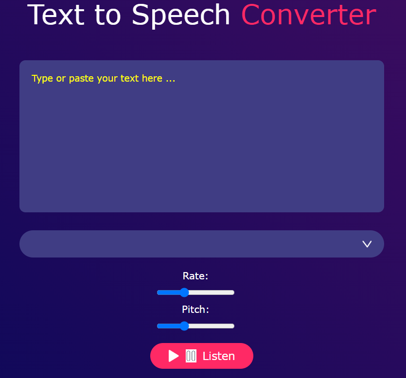

# text_to_speech_converter
### version 1.0.0
This app generates English text to speech. Uses  SpeechSynthesisUtterance() javascript API for text-to-speech conversion.  It comes with functionalities for pitch and speech rate control.

## :flashlight: Description
 
1. TTS apps are useful to individuals with visual impairements or reading difficulties.   2. They can also be used for language learning, E.g. the Duolingo app.   3. In some cases, TTS apps enable hands-free content consumption by listening to apps, e-books, or webpages without having to scroll around, e.g. when driving or exercising.   4. For advanced users, TTS apps can help in voice-overs and narrations in need of animations or audio content.  So this is a very useful app!

## :pushpin: Installation Requirements
The app does not need any installations to work.
## Known Bugs
There are no known bugs.
## :pushpin: BDD
Upon clicking the listen button, the app starts the conversion proess. You can adjust the rate and pitch before clicking it, after choosing the voice-language. 
## Screenshot:

## :computer: Technologies Used
 The project used HTML, css, and Vanilla JS.
Code contributions are also welcome.
